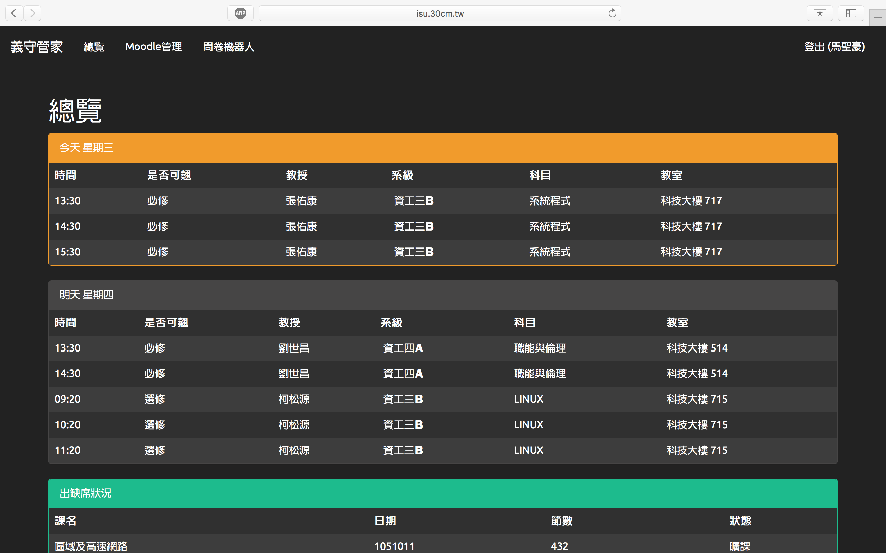
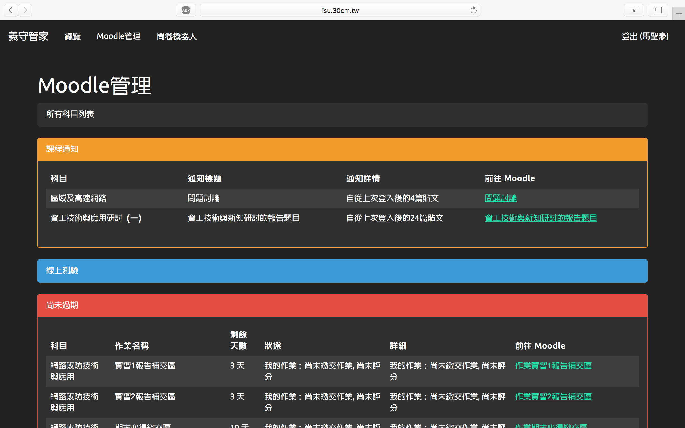
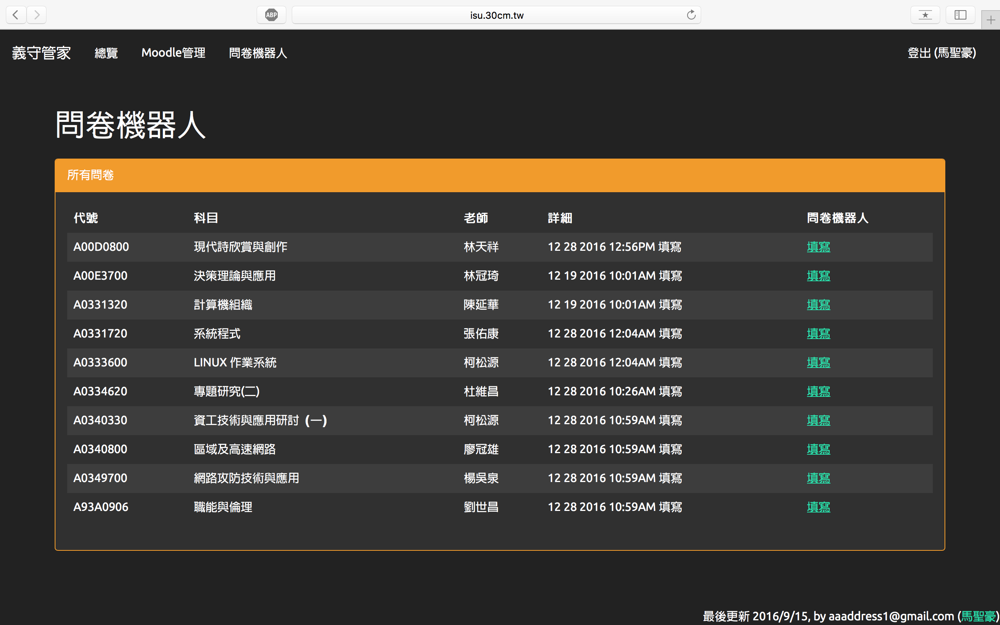

# Node-isuSurvey
=========

這是什麼？
---------
這是基於 Node.js 開發的專案，整合義守大學的應用資訊系統、Moodle系統為統一第三方雲端服務，目前部署於 isu.30cm.tw 供義守大學學生使用。

功能
---------

* 今明兩日課表彙整（時間／日期／教室／選必修）
* Moodle 小考資訊／作業狀況即時彙整／公告彙整
* 自動填寫期中／期末問卷
* 自動替瀏覽本服務的用戶跨域名登入學校 Moodle 

如何使用？
---------
如果您正在尋找網頁版本，請至 義守管家 ([isu.30cm.tw](https://isu.30cm.tw))
如有特殊需求也可下載此份專案自行部署使用。